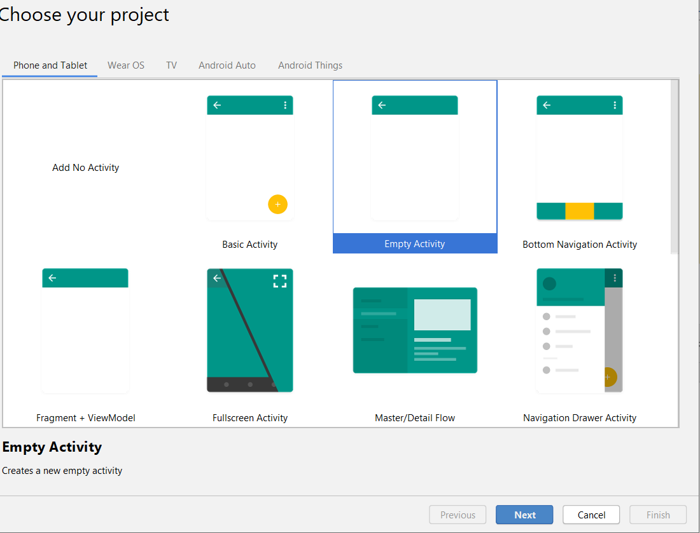
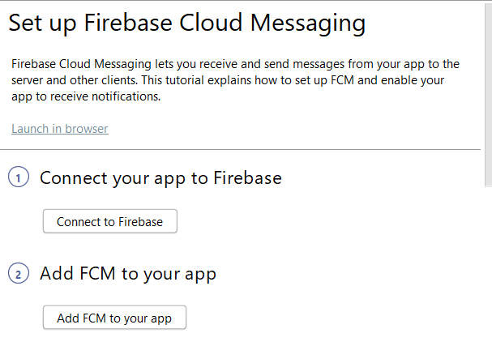
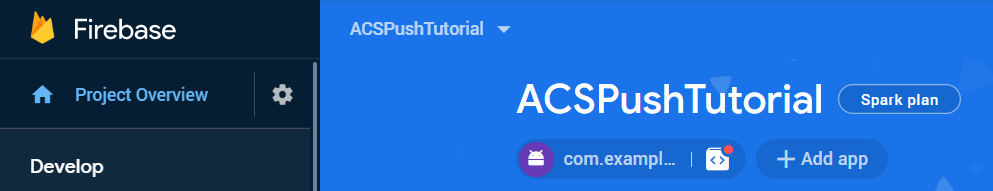
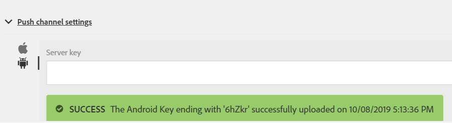

# 手順1 - [!DNL Android] アプリを作成し、[!DNL Firebase Cloud Messaging]を使用するように設定する

このパートでは、[!DNL Android] アプリを作成して、Adobe Campaign Standardから[!UICONTROL Push notifications]を受信します。 プッシュ通知を受け取るには、アプリをGoogleの[!DNL Firebase Cloud Service]に登録する必要があります。

1. [!DNL Firebase] アカウントにログインします。

   [!DNL Firebase]は、高品質なアプリをすばやく開発できるGoogleのモバイル プラットフォームです。 [!DNL Firebase] アカウントをお持ちでない場合は、ここから[&#x200B; アカウントを作成してください](https://firebase.google.com)。

2. [!DNL Android Studio]を起動
3. **[!UICONTROL File]** > **[!UICONTROL New]** > **[!UICONTROL New Project]をクリックします。**
4. **[!UICONTROL Empty Activity]**&#x200B;を選択し、**[!UICONTROL Next]をクリックします。**

   

5. プロジェクトに意味のある名前を付けます。

   このデモでは、プロジェクトを&#x200B;*[!DNL ACSPushTutorial]*&#x200B;として指定しました

   

6. 既定のパッケージ名を承認し、**[!DNL Finish]**&#x200B;をクリックしてプロジェクトを作成します。
7. プロジェクトの構造は、次のスクリーンショットと似ています

   

8. **[!UICONTROL Tools]** > **[!UICONTROL Firebase].**&#x200B;をクリックします （これにより、プロジェクトが[!DNL Firebase]に追加されます）
9. **[!UICONTROL Set up Firebase Cloud Messaging].**&#x200B;をクリックします

   

10. **[!UICONTROL Connect to Firebase].**&#x200B;をクリックします
11. アプリをFirebaseに接続したら、**[!UICONTROL Add FCM to your app]をクリックします。**
12. **[!UICONTROL Accept Changes].**&#x200B;をクリックします

   アプリにFCMを追加する場合、プロジェクトに変更を加えるには、ウィザードに権限が必要です。

   ![[!DNL add-fcm-to-your-app]](assets/firebase-add-fcm-to-app.PNG)

アプリをFirebaseと正常に統合すると、次のようなメッセージが表示されます。

![[!DNL fcm-successfull]](assets/android-firebase-success.PNG)

[プロジェクトが [!DNL Firebase &#x200B;] コンソールにリストされていることを確認してください](https://console.firebase.google.com/)

## [!UICONTROL Push Channel]設定の構成

1. [!DNL Firebase] コンソールにログイン
2. **[!UICONTROL ACSPushTutorial]** プロジェクトを開きます。
3. **ギアアイコン**&#x200B;をクリックし、プロジェクト設定を開きます

   

4. 「**[!UICONTROL Cloud Messaging]**」タブにタブします。
5. サーバーキーをコピー

   

6. Adobe Campaign Standard インスタンスへのログイン
7. **[!UICONTROL Adobe Campaign]** > **[!UICONTROL Administration]** > **[!UICONTROL Channels]** > **[!UICONTROL Mobile App]をクリックします。**
8. 適切な&#x200B;**[!UICONTROL Mobile Application Property].**&#x200B;を選択してください
9. **[!UICONTROL Push Channel settings]** セクションの&#x200B;**[!DNL Android]アイコン**&#x200B;をクリックします。
10. サーバーキーフィールドにサーバーキーを貼り付けます。

すべてがうまくいけば、成功のメッセージを見ることができます。

要約すると、[!DNL Android App]を作成し、[!DNL Android App]を[!DNL Firebase]に接続しました。 次に、[!DNL Android] アプリのサーバーキーをAdobe Campaign Standardのモバイルアプリに貼り付けて、Adobe Campaignのモバイルアプリを[!DNL Android App]に接続しました。
