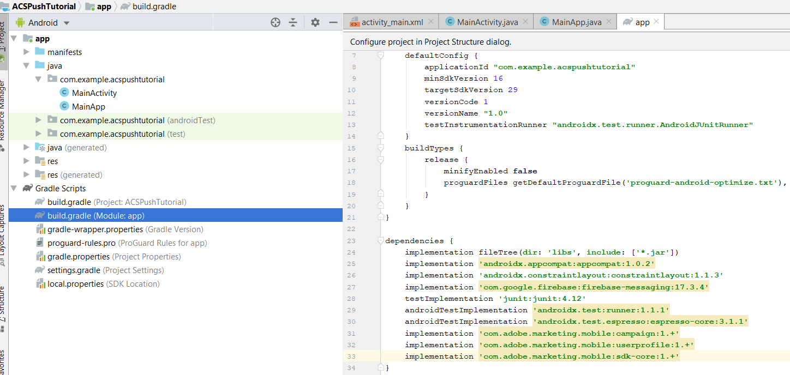

# 手順 2 - [!UICONTROL Mobile SDK] とAndroid アプリを統合する

ここでは、[!DNL Android] アプリを [!UICONTROL Mobile SDK] と統合します。 [!UICONTROL mobile SDK] を [!DNL Android] アプリと統合するには、次の手順に従います。

* [!DNL Android Studio] で *ACSPushTutorial* プロジェクトを開きます
* [!DNL android.app.Application] を拡張する *MainApp* という新しい Java クラスを作成します
* この時点でのプロジェクト構造は次のようになります


* [!DNL Gradle Scripts] フォルダーを展開します。 モジュール [!DNL build.gradle] をダブルクリックします。 次の依存関係をに [!DNL build.gradle] ファイルの依存関係セクションに貼り付けます。 [!DNL build.gradle] ファイルは次のようになります

<!--
Removed `{.line-numbers}` below
-->

```java
implementation 'com.adobe.marketing.mobile:campaign:1.+'
implementation 'com.adobe.marketing.mobile:userprofile:1.+'
implementation 'com.adobe.marketing.mobile:sdk-core:1.+'
```



* 「今すぐ同期」ボタンをクリックして [!DNL Android] プロジェクトを同期します

## [!DNL AndroidManifest.xml] を変更{#modify-android-manifest}

*AndroidManifest.xml* を開き、manifest 要素の後、application 要素の前に、次の 2 行をペーストします。 これにより、アプリが外部と通信できるようになります

<!--
Removed `{.line-numbers}` below
-->

```xml
<uses-permission android:name="android.permission.INTERNET" />
<uses-permission android:name="android.permission.ACCESS_NETWORK_STATE" />
```

アプリケーション要素で次の行をコピーします
[!DNL android:name=".MainApp"]
[!DNL AndroidManifest.xml] を保存します
[!DNL AndroidManifest.xml] は次のようになります

<!--
Removed `{.line-numbers}` below
-->

```xml
<?xml version="1.0" encoding="utf-8"?>
<manifest xmlns:android="http://schemas.android.com/apk/res/android"
    package="com.example.acspushtutorial">
    <uses-permission android:name="android.permission.INTERNET" />
    <uses-permission android:name="android.permission.ACCESS_NETWORK_STATE" />

<application
    android:name=".MainApp"
    android:allowBackup="true"
    android:icon="@mipmap/ic_launcher"
    android:label="@string/app_name"
    android:roundIcon="@mipmap/ic_launcher_round"
    android:supportsRtl="true"
    android:theme="@style/AppTheme">

<activity android:name=".MainActivity">
<intent-filter>
    <action android:name="android.intent.action.MAIN" />
    <category android:name="android.intent.category.LAUNCHER" />
</intent-filter>
</activity>
</application>

</manifest>
```
