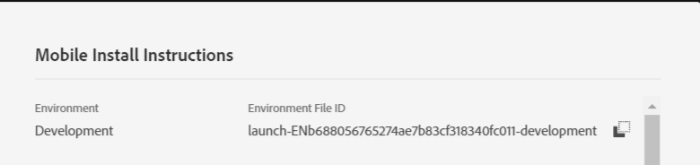

# 手順 3 - モバイルアプリに拡張機能を登録

この部分では、ユーザープロファイル、ID、ライフサイクル、およびSignal拡張機能を登録するコードを追加します。 また、以下のコードに示すように、Adobe Campaign Standard拡張機能を登録する必要があります。

[!DNL Android] Studioでプロジェクトを開きます。 パッケージ文&#x200B;**の最初の行を除き、MainApp**&#x200B;のコード全体を削除します。

次のコードをMainAppにペーストします

<!--
Removed `{.line-numbers}` below
-->

```java
import [!DNL android].app.Application;
import android.util.Log;

import com.adobe.marketing.mobile.AdobeCallback;
import com.adobe.marketing.mobile.Campaign;
import com.adobe.marketing.mobile.Identity;
import com.adobe.marketing.mobile.InvalidInitException;
import com.adobe.marketing.mobile.Lifecycle;
import com.adobe.marketing.mobile.LoggingMode;
import com.adobe.marketing.mobile.MobileCore;
import com.adobe.marketing.mobile.Signal;
import com.adobe.marketing.mobile.UserProfile;

public class MainApp extends Application {

@Override
public void onCreate() {
super.onCreate();

MobileCore.setApplication(this);
MobileCore.setLogLevel(LoggingMode.DEBUG);

try{
    Campaign.registerExtension();
    UserProfile.registerExtension();
    Identity.registerExtension();
    Lifecycle.registerExtension();
    Signal.registerExtension();
    MobileCore.start(new AdobeCallback () {
        @Override
        public void call(Object o) {
            MobileCore.configureWithAppID("copy your launch property id here");
        }
    });
} catch (InvalidInitException e) {
    Log.d("ACS Exception", "exception");
}
}
}
```

32行目[!UICONTROL &#x200B; Launch] プロパティの環境ファイル IDを指定する必要があります。 これは、[!UICONTROL Launch] プロパティの[!UICONTROL environment tab]からアクセスできます。


