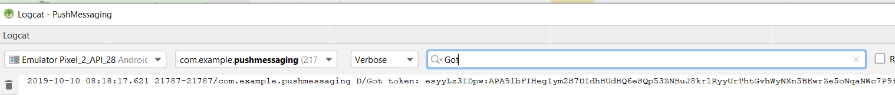

# 手順4 - [!DNL pushidentifier]を設定

**[!DNL pushidentifier]**&#x200B;は、[!DNL Push]通知のデバイストークンを含む文字列です。 これは、[!DNL Firebase]によって送信され、[!DNL MobileCore.setPushIdentifier] メソッドを使用してSDKに渡されるのと同じトークンです。

[!DNL Android™]studioでプロジェクトを開きます。 [!DNL MainActivity] **のコード全体を削除します。ただし、最初の行はパッケージのステートメント**&#x200B;です。

次のコードを[!DNL MainActivity]に貼り付けます：

<!--
Removed `{.line-numbers}` below
-->

```java
import androidx.annotation.NonNull;
import androidx.appcompat.app.AppCompatActivity;

import android.os.Bundle;
import android.util.Log;
import android.widget.Toast;

import com.adobe.marketing.mobile.MobileCore;
import com.google.android.gms.tasks.OnCompleteListener;
import com.google.android.gms.tasks.Task;
import com.google.firebase.iid.FirebaseInstanceId;
import com.google.firebase.iid.InstanceIdResult;

public class MainActivity extends AppCompatActivity {

@Override
protected void onCreate(Bundle savedInstanceState) {
super.onCreate(savedInstanceState);
setContentView(R.layout.activity_main);

registerToken();
}

void registerToken() {
FirebaseInstanceId.getInstance().getInstanceId()
    .addOnCompleteListener(new OnCompleteListener<InstanceIdResult>() {
        @Override
        public void onComplete(@NonNull Task<InstanceIdResult> task) {
            if (!task.isSuccessful()) {
                Log.w("Message App", "getInstanceId failed", task.getException());
                return;
            }

// Get new Instance ID token
String token = task.getResult().getToken();

Log.d("Got token", token);

MobileCore.setPushIdentifier(token);
}
});
}

@Override
public void onResume() {
super.onResume();
MobileCore.setApplication(getApplication());
MobileCore.lifecycleStart(null);
}

@Override
public void onPause() {
super.onPause();
MobileCore.lifecyclePause();
}
}
```

## アプリをテスト

アプリをテストする良い機会です。次に進む前に。

* 緑の矢印をクリックするか、**[!DNL Run->Run'app']**&#x200B;を選択してアプリを実行します。
* [!DNL Android™] エミュレーターが起動し、[!DNL "Hello World"] テキストでアプリが実行されます。
* [!DNL logcat] ウィンドウを開きます。 「[!DNL Got]」を検索します。 ログに書き込まれた[!DNL Firebase]から受信したトークンは、次のように表示されます。 「[!DNL Got token]」の後の長い文字列は、Adobe Campaignに送信される[!DNL pushidentifier]です。



### モバイルアプリケーションのサブスクライバーを確認する

Adobe Campaign Standard インスタンスにログインします。
**[!UICONTROL Administration->Channels->Mobile App(Experience Platform SDK)]**&#x200B;に移動します。 適切なモバイルアプリケーションを開きます。 「[!UICONTROL Mobile Application Subscribers]」タブにタブします。 リストに[!UICONTROL registration token]が表示されます。


>[!NOTE]
>
>[!UICONTROL Mobile Application Subscribers] タブに登録トークンが表示されない場合は、先に進む前にここで停止してください。
